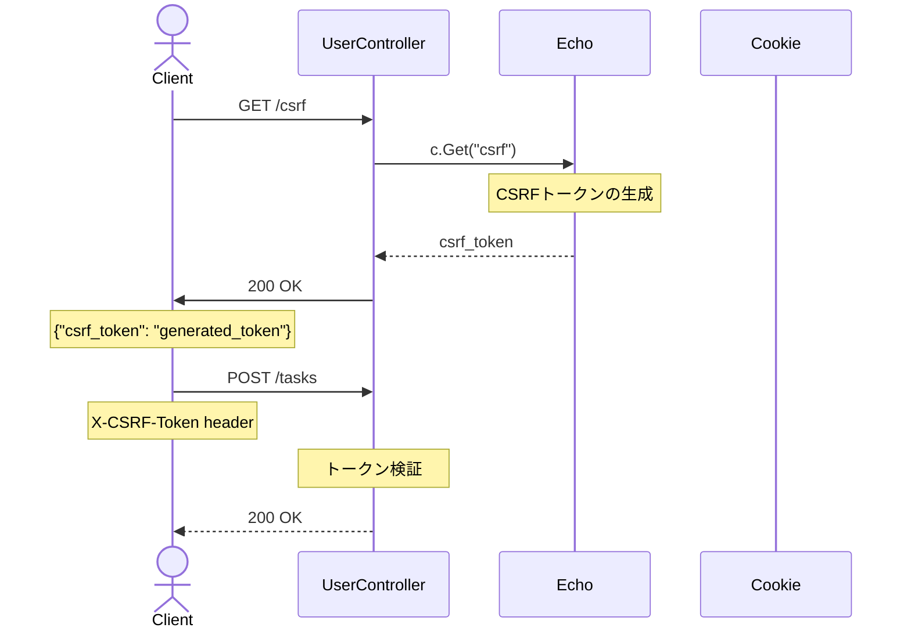

```mermaid
sequenceDiagram
    actor Client
    participant UserController
    participant Echo
    participant Cookie

    Client->>UserController: GET /csrf
    UserController->>Echo: c.Get("csrf")
    Note over Echo: CSRFトークンの生成
    Echo-->>UserController: csrf_token

    UserController->>Client: 200 OK
    Note over Client: {"csrf_token": "generated_token"}

    Client->>UserController: POST /tasks
    Note over Client: X-CSRF-Token header
    Note over UserController: トークン検証
    UserController-->>Client: 200 OK
```
