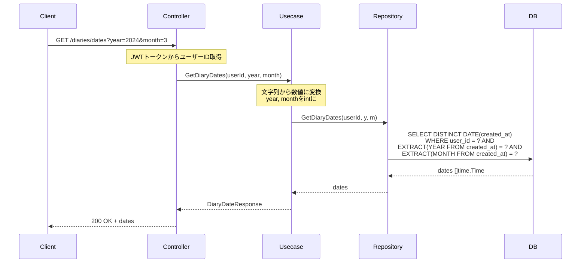

```mermaid
sequenceDiagram
    participant Client
    participant Controller
    participant Usecase
    participant Repository
    participant DB

    Client->>Controller: GET /diaries/dates?year=2024&month=3
    Note over Controller: JWTトークンからユーザーID取得

    Controller->>Usecase: GetDiaryDates(userId, year, month)
    Note over Usecase: 文字列から数値に変換<br/>year, monthをintに

    Usecase->>Repository: GetDiaryDates(userId, y, m)

    Repository->>DB: SELECT DISTINCT DATE(created_at)<br/>WHERE user_id = ? AND<br/>EXTRACT(YEAR FROM created_at) = ? AND<br/>EXTRACT(MONTH FROM created_at) = ?

    DB-->>Repository: dates []time.Time
    Repository-->>Usecase: dates

    Usecase-->>Controller: DiaryDateResponse
    Controller-->>Client: 200 OK + dates
```
