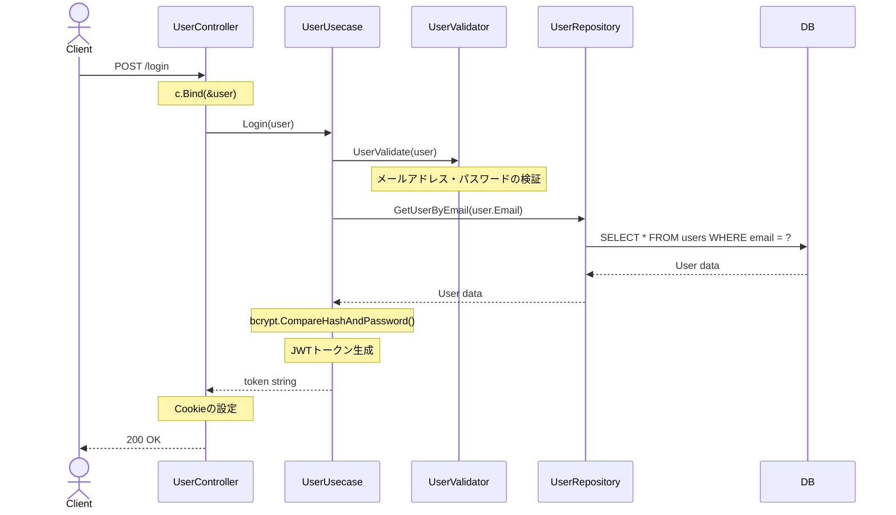

```mermaid
sequenceDiagram
    actor Client
    participant UserController
    participant UserUsecase
    participant UserValidator
    participant UserRepository
    participant DB

    Client->>UserController: POST /login
    Note over UserController: c.Bind(&user)

    UserController->>UserUsecase: Login(user)
    UserUsecase->>UserValidator: UserValidate(user)
    Note over UserValidator: メールアドレス・パスワードの検証

    UserUsecase->>UserRepository: GetUserByEmail(user.Email)
    UserRepository->>DB: SELECT * FROM users WHERE email = ?
    DB-->>UserRepository: User data
    UserRepository-->>UserUsecase: User data

    Note over UserUsecase: bcrypt.CompareHashAndPassword()
    Note over UserUsecase: JWTトークン生成

    UserUsecase-->>UserController: token string
    Note over UserController: Cookieの設定
    UserController-->>Client: 200 OK
```
