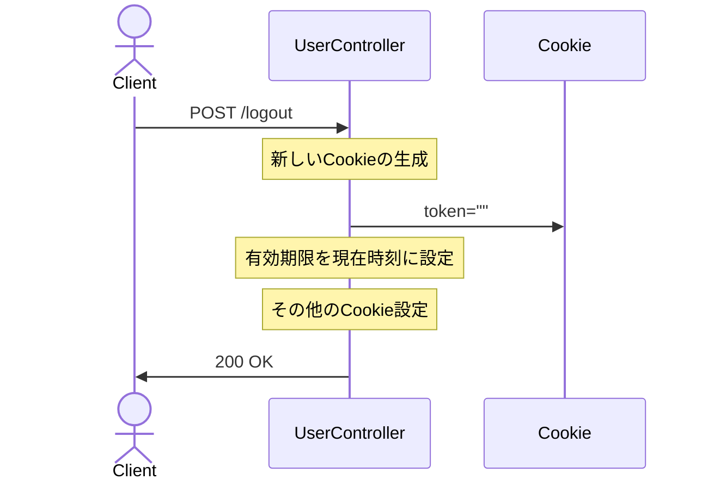

```mermaid
sequenceDiagram
    actor Client
    participant UserController
    participant Cookie

    Client->>UserController: POST /logout
    Note over UserController: 新しいCookieの生成

    UserController->>Cookie: token=""
    Note over UserController: 有効期限を現在時刻に設定
    Note over UserController: その他のCookie設定

    UserController->>Client: 200 OK
```
