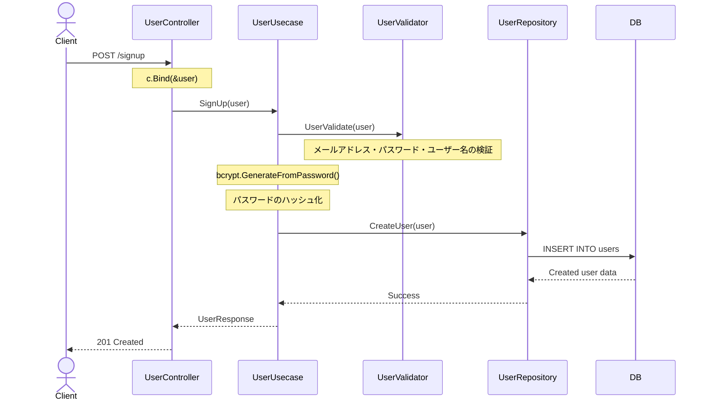

```mermaid
sequenceDiagram
    actor Client
    participant UserController
    participant UserUsecase
    participant UserValidator
    participant UserRepository
    participant DB

    Client->>UserController: POST /signup
    Note over UserController: c.Bind(&user)

    UserController->>UserUsecase: SignUp(user)
    UserUsecase->>UserValidator: UserValidate(user)
    Note over UserValidator: メールアドレス・パスワード・ユーザー名の検証

    Note over UserUsecase: bcrypt.GenerateFromPassword()
    Note over UserUsecase: パスワードのハッシュ化

    UserUsecase->>UserRepository: CreateUser(user)
    UserRepository->>DB: INSERT INTO users
    DB-->>UserRepository: Created user data
    UserRepository-->>UserUsecase: Success

    UserUsecase-->>UserController: UserResponse
    UserController-->>Client: 201 Created
```
